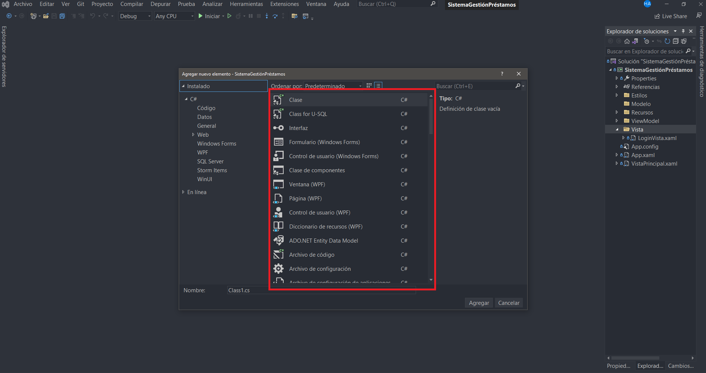
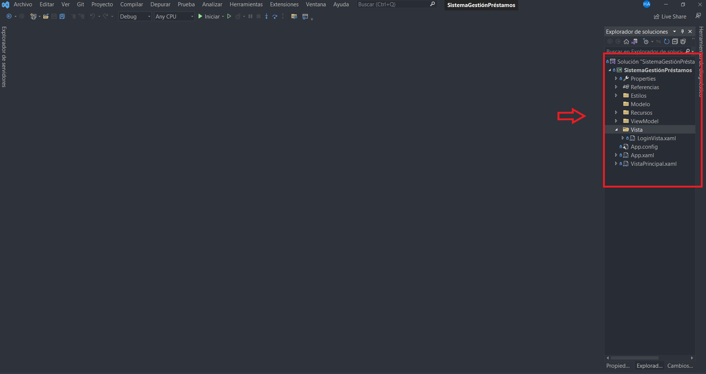
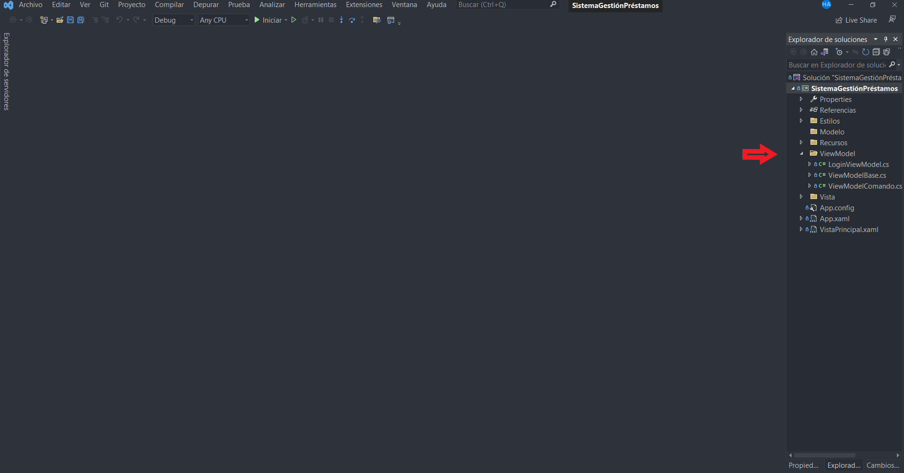
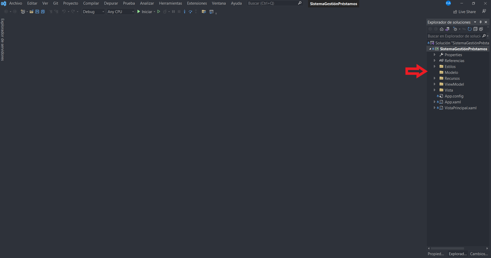
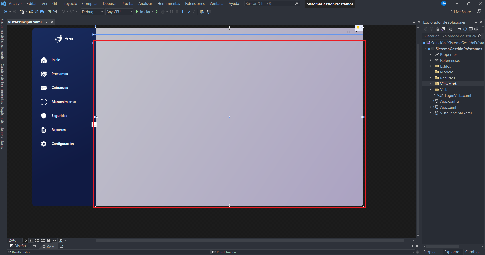

# Sistema-Gestion-Prestamos
Proyecto de la clase Desarrollo de Software

## Requisitos
- Visual Studio 2022
- Aplicación de WPF (.NET Framework) versión 4.8

## Metodo de Trabajo
Se trabaja utilizando el metodo MVVM. El cual es un patrón arquitectónico de software que se utiliza comúnmente en el desarrollo de
aplicaciones de software para separar la lógica de la interfaz de usuario (UI) de la lógica del negocio y los datos subyacentes.

El patrón MVVM consta de tres componentes principales:

- Modelo (Model): representa los datos y la lógica del negocio subyacente, como la validación de datos, el acceso a bases de datos y la manipulación de datos.
- Vista (View): representa la interfaz de usuario (UI) que se muestra al usuario final y es responsable de la presentación de los datos y la interacción del usuario.
- ViewModel: actúa como un intermediario entre la Vista y el Modelo, y es responsable de realizar la lógica de presentación y manipulación de datos necesaria para la
Vista. También se encarga de manejar eventos y comandos de la Vista y actualizar el Modelo en consecuencia.

### ¿Por qué MVVM?

El patrón MVVM permite una separación clara de las responsabilidades en una aplicación de software, lo que facilita la escalabilidad, el mantenimiento y la colaboración
en el desarrollo del software. Además, MVVM también permite pruebas unitarias más efectivas y mejora la reutilización de código en diferentes partes de la aplicación.

## Metodología
 Se debe trabajar con las carpetas correspondientes a cada componente. 
 - Para vistas se utiliza el elemento user control
 - Para ViewModel se utiliza el elemento clase
 
 Aqui la ventana en donde se encuentran los elementos:
 
 
 
 ### Vistas o Views
 Los modulos y submodulos se desarrollan dentro **carpeta vista**, la cual es para vistas.
 Las vistas se crean utilizando el elemento **user control**.
 
 
 
 ### ViewModel
 Se desarrollan dentro de la carpeta ViewModel. Los viewmodels se crean utilizando el elemento **Clases**.
 
 
 
  ### Model
 Se desarrollan dentro de la carpeta Model.
 
 
 
 ### Ubicación gráfica de las vistas
 Las vistas irán detro de la tercera fila del grid, como se muestra en a continuación:
 
 
 
 
 
